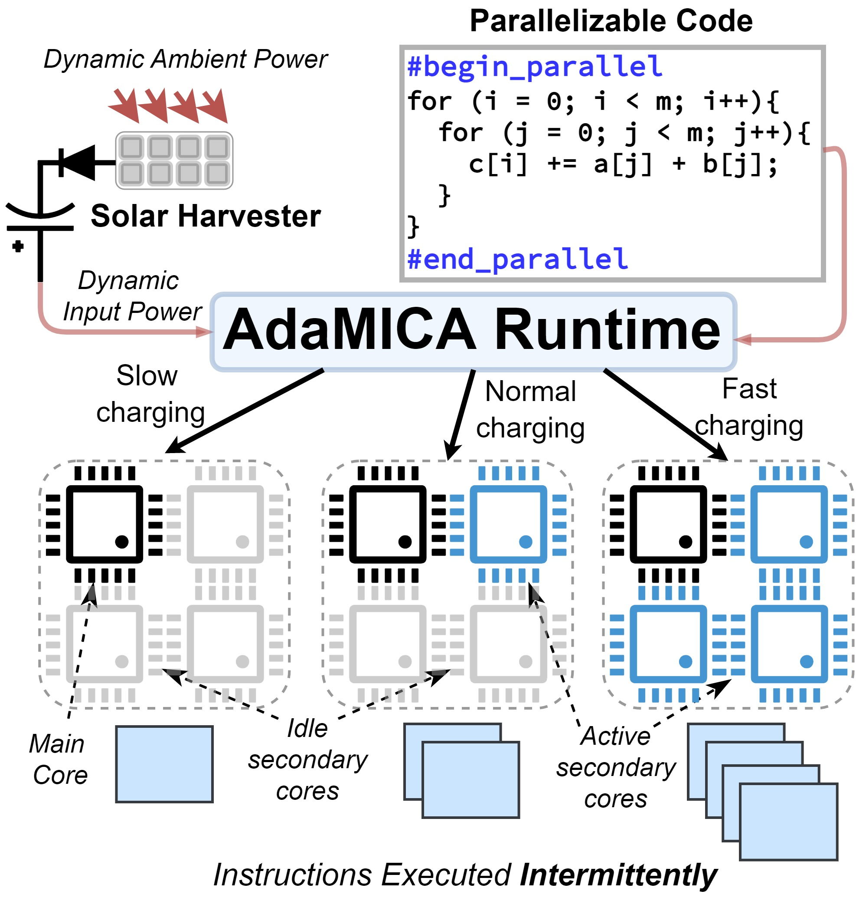

# [IMWUT/UbiComp 2022] AdaMICA: Adaptive Multicore Intermittent Computing

## Introduction

This repository contains the python simulator and lightweight runtime implementation on MSP430FR presented in the paper titled **[AdaMICA: Adaptive Multicore Intermittent Computing](https://dl.acm.org/doi/10.1145/3550304)**. AdaMICA is an intermittent computing runtime that supports parallel intermittent multicore computing and provides the highest degree of flexibility of programmable general-purpose multiple cores. AdaMICA adaptively switches to the best multicore configuration considering the dynamic input power. Therefore, it allows an intermittent system to benefit from workload parallelization, thereby running complex computational tasks faster to increase systems throughput and decrease end-to-end delay while considering the energy availability.



The figure provides a high-level overview of the AdaMICA operating principle. AdaMICA enables programmers to annotate parallelizable code blocks that can be executed over multiple cores intermittently. Considering the available power, it reconfigures the multicore architecture to obtain the maximum benefit from the ambient energy and parallelism.

Please find the description of the repository components in the corresponding folders.

## Citation (BibTeX)
```
@article{akhunov2022adamica,
    author = {Akhunov, Khakim and Yildirim, Kasim Sinan},
    title = {AdaMICA: Adaptive Multicore Intermittent Computing},
    year = {2022},
    issue_date = {Sept 2022},
    publisher = {Association for Computing Machinery},
    address = {New York, NY, USA},
    volume = {6},
    number = {3},
    url = {https://doi.org/10.1145/3550304},
    doi = {10.1145/3550304},
    journal = {Proc. ACM Interact. Mob. Wearable Ubiquitous Technol.},
    month = {sep},
    articleno = {98},
    numpages = {30},
    keywords = {Intermittent Computing, Adaptation, Energy Harvesting, Batteryless Platform}
}
```