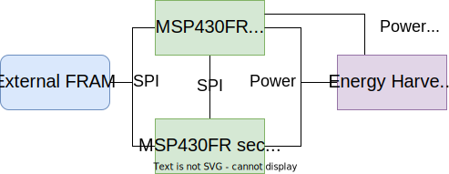

# AdaMICA implementation using two connected MSP430FR5994 boards

## Description

In this toy example, AdaMICA is used to implement matrix-matrix multiplication on emulated dual-core system.

## Dependencies

- [Code Composer Studio (CCS) (>= v8)](http://www.ti.com/tool/CCSTUDIO)
- [FRAM Unility (>= 03.10)](https://www.ti.com/tool/MSP-FRAM-UTILITIES) 

## Content of the Project

```
.
├── Inluces
    ├── adamicalib
        ├── adamica.c       : AdaMICA library
        ├── adamica.h       : AdaMICA library
    ├── memlib
        ├── extfram.c       : Access to external FRAM
        ├── extfram.h       : Access to external FRAM
        ├── fram.h          : FRAM attributes
├── fram-unilities
    ├── ctpl                : Compute Through Power Loss Library
    ├── nvs                 : Non-Volatile Storage Libraty
├── README.md               : This file
├── ctpl_msp430fr5994.c     : Part of FRAM Utilities
├── ctpl_pre_init.c         : Part of FRAM Utilities
├── main.c                  : The main file of the project 
```

## How to run?

Open the project in CCS, connect the hardware setup, and press "Debug" button.

## Hardware Setup

For this implementation, we used two MSP430FR5994 boards representing two cores. As a shared memory, we used external 4MB FRAM from Adafruit. The energy harvester is a solar pannel with a 1500 uF capacitor. The schematic representation of the setup is shown below.


