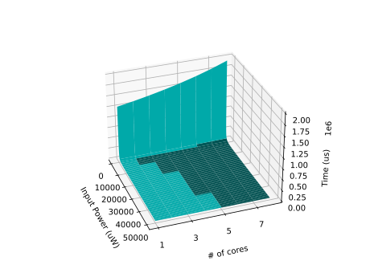
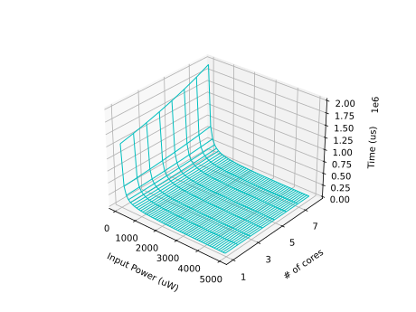
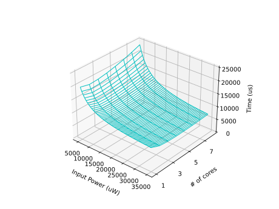
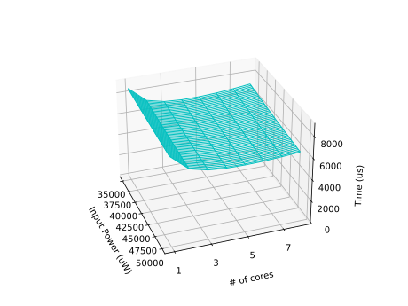
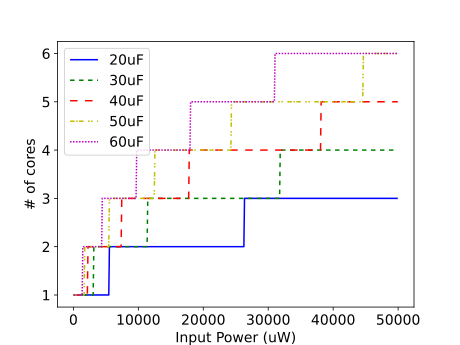
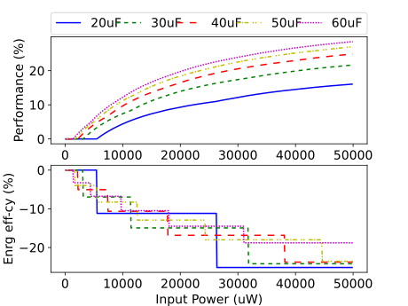
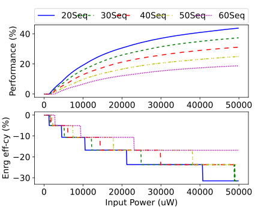

# Python Simulation of the Energy and Performance Models of Multicore Intermittent Computing

## Introduction

The Python script implements the simulation of the models presented in the AdaMICA paper. The configurations of the target system are provided in a separate configuration file. The simulation outputs 3D and 2D plots showing the performance and energy consumption of the system under different internal and external conditions such as capacitor size, parallel fraction, number of cores, and input power level.

## Content of the Project

```
.
├── README.md       : This file
├── capacitor.py    : Capacitor specification
├── charts.py       : Printing 3D and 2D diagrams
├── common.py       : Reading and sharing data from the configuration file
├── config.json     : Configuration file
├── cpu.py          : CPU(s) specification
├── sim_main.py     : Main file that runs the simulation
├── sstm.py         : System specification
```

## Output

### 3D plots

The performance dependence on the incoming power and the number of cores working on a task
<p float="left">
  
  
  
  
</p>
### 2D plots

Comparison of the speed up and the energy efficiency drop of multicore intermittent systems.
<p float="left">
  
  
  
</p>
